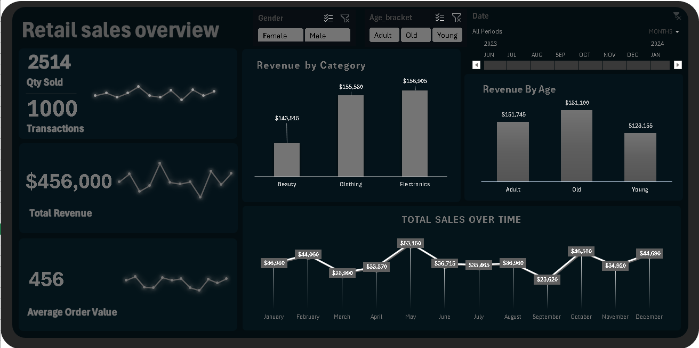

# Retail Sales Analysis (Excel Dashboard)

##  Project Overview
This project analyzes retail sales data to uncover trends, identify top-performing products, and evaluate revenue performance.  
Using Microsoft Excel, I built a fully interactive dashboard with pivot tables, slicers, and charts to present insights clearly.

---

##  Objectives
- Track overall sales performance over time.
- Identify top-selling categories and products.
- Monitor monthly/seasonal trends in sales.
- Provide a simple, interactive way to explore the dataset.

---

## Tools Used
- **Excel**
  - Pivot Tables  
  - Pivot Charts  
  - Slicers & Filters  
  - Dashboard Formatting

---

##  Key Insights
- Seasonal trends reveal spikes during key shopping months.  
- Certain categories consistently outperform others.  
- Interactive slicers allow quick exploration of sales by region, product, and time.

---

##  Files in Repository
- `retail_sales_dataset_raw` -> the raw uncleaned file
- `retail_pivots_dashboard.xlsx` → Cleaned dataset with pivot tables and dashboard  
- `README.md` → Project documentation  
- `retail_Dashboard.png` → Screenshot of the dashboard  

---

##  How to Use
1. Clone/download this repository.  
2. Open the file `retail_pivots_dashborad.xlsx` in Excel.  
3. Explore the dashboard using slicers and filters.  

---

##  Dashboard Preview

---

## 🔗 Contact
If you’d like to collaborate or learn more, feel free to reach out:  
**Crystal Obidike** – Frontend Developer & Data Analyst
**Email** crystalobidike@gmail.com
